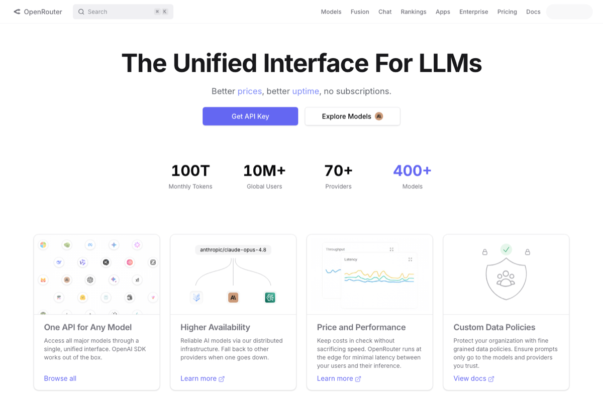
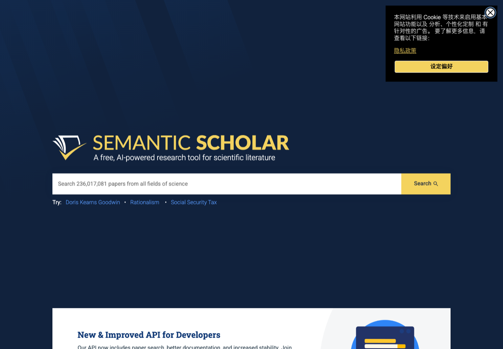
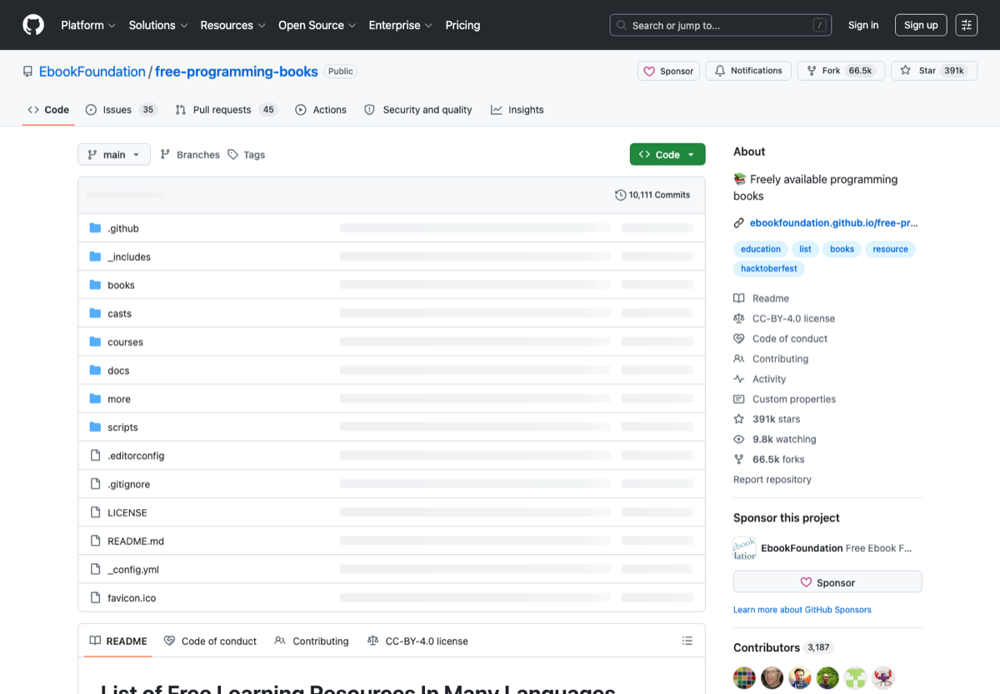
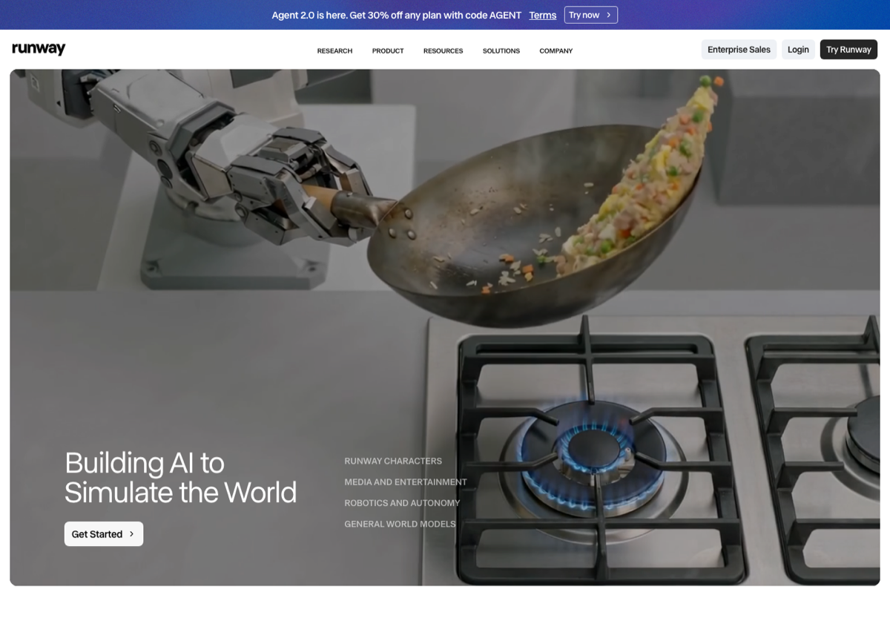

# Awesome Practical CN

> 20 个中文实用信息汇总贴：AI 工具、学生福利、科研论文、免费课程、设计素材、远程开发、效率工具、PDF/OCR、自托管、量化、镜像站等。

<p align="center">
  
</p>

## 为什么做这个

中文互联网上不缺碎片链接，缺的是可以直接收藏、转发、持续维护的高质量总表。本仓库把不同领域的常用入口整理成 20 个独立专题，每个专题都包含：

- 一句话定位
- 官方入口 / 下载入口 / GitHub 链接
- 适合谁
- 快速上手顺序
- 常见坑
- 官方公开页面截图与来源链接

> 截图说明：本仓库优先使用官方公开网页的自动截图，并在每个专题页标注截图来源。若某网站禁止自动截图或页面不可访问，则保留来源链接并等待人工补图。

## 热门专题预览

<p>
<a href="docs/guides/ai-coding-tools.md"></a>
<a href="docs/guides/llm-api-platforms.md"></a>
<a href="docs/guides/student-dev-perks.md"></a>
<a href="docs/guides/research-paper-tools.md"></a>
<a href="docs/guides/free-books-courses.md"></a>
<a href="docs/guides/design-assets-icons.md"></a>
<a href="docs/guides/ai-media-tools.md"></a>
<a href="docs/guides/remote-dev-server.md"></a>
</p>

## 20 个专题

| # | 专题 | 分类 | 适合人群 | 链接数 |
| ---: | --- | --- | --- | ---: |
| 01 | [AI 编程工具中文选型](docs/guides/ai-coding-tools.md) | AI / 编程 | 学生、研究生、开发者、开源维护者 | 8 |
| 02 | [LLM API 与模型平台入口](docs/guides/llm-api-platforms.md) | AI / API | 做 AI 应用、机器人、Agent、论文实验的人 | 8 |
| 03 | [学生党 AI 与开发者福利](docs/guides/student-dev-perks.md) | 学生 / 福利 | 本科生、研究生、刚开始做项目的学生 | 8 |
| 04 | [科研论文检索与阅读工具](docs/guides/research-paper-tools.md) | 科研 / 论文 | 研究生、科研党、写综述和开题的人 | 8 |
| 05 | [免费电子书与公开课程](docs/guides/free-books-courses.md) | 学习 / 课程 | 自学编程、数学、AI、计算机基础的人 | 8 |
| 06 | [设计素材、图标与配图资源](docs/guides/design-assets-icons.md) | 设计 / 素材 | 做 README、论文图、PPT、网页和产品 demo 的人 | 8 |
| 07 | [AI 图片、视频与音频生成工具](docs/guides/ai-media-tools.md) | AI / 生成 | 做短视频、演示图、产品宣传、视觉实验的人 | 8 |
| 08 | [远程开发、服务器与内网穿透](docs/guides/remote-dev-server.md) | 开发 / 服务器 | 学生服务器、实验室 GPU、远程办公和个人服务部署用户 | 8 |
| 09 | [macOS 效率工具清单](docs/guides/macos-productivity.md) | macOS / 效率 | Mac 用户、学生、开发者、研究生 | 8 |
| 10 | [Windows 效率与开发工具](docs/guides/windows-productivity.md) | Windows / 效率 | Windows 用户、学生、开发者 | 8 |
| 11 | [知识管理与 Obsidian 工作流](docs/guides/knowledge-management.md) | 知识管理 | 写论文、记笔记、做项目复盘的人 | 8 |
| 12 | [PDF、OCR 与文档处理工具](docs/guides/pdf-ocr-docs.md) | 文档 / OCR | 处理论文、扫描件、合同、电子书和课件的人 | 8 |
| 13 | [自托管服务与 NAS 工具](docs/guides/selfhosted-nas.md) | 自托管 / NAS | 想搭家庭服务器、NAS、个人云和内网服务的人 | 8 |
| 14 | [开源替代软件清单](docs/guides/open-source-alternatives.md) | 开源 / 替代 | 想找免费、开源、跨平台软件的人 | 8 |
| 15 | [量化交易、回测与行情数据](docs/guides/quant-trading-backtest.md) | 金融 / 量化 | 想做量化机器人、回测、纸交易和数据分析的人 | 8 |
| 16 | [数据分析与可视化工具](docs/guides/data-visualization.md) | 数据 / 可视化 | 科研、运营、产品、数据分析和 dashboard 用户 | 8 |
| 17 | [API 调试与后端开发工具](docs/guides/api-backend-tools.md) | 后端 / API | 后端、全栈、AI 应用开发者 | 8 |
| 18 | [GitHub 开源项目包装与发布](docs/guides/github-project-packaging.md) | GitHub / 开源 | 想让项目更像正式开源产品的人 | 8 |
| 19 | [隐私、安全与密码管理工具](docs/guides/privacy-security.md) | 安全 / 隐私 | 学生、开发者、远程办公和注重隐私的人 | 8 |
| 20 | [中文开源镜像与下载加速](docs/guides/cn-mirrors-downloads.md) | 下载 / 镜像 | 国内开发者、学生、服务器用户 | 8 |

## 20 个独立仓库版本

如果只想收藏某一个方向，可以直接看拆分后的独立仓库：

| 方向 | 独立仓库 |
| --- | --- |
| AI 编程工具 | [cn-ai-coding-toolbox](https://github.com/StaryMoon/cn-ai-coding-toolbox) |
| LLM API 入口 | [cn-llm-api-map](https://github.com/StaryMoon/cn-llm-api-map) |
| 学生开发者福利 | [cn-student-dev-perks](https://github.com/StaryMoon/cn-student-dev-perks) |
| 科研论文工具 | [cn-research-paper-toolbox](https://github.com/StaryMoon/cn-research-paper-toolbox) |
| 免费书与公开课 | [cn-free-books-courses](https://github.com/StaryMoon/cn-free-books-courses) |
| 设计素材与图标 | [cn-design-assets-map](https://github.com/StaryMoon/cn-design-assets-map) |
| AI 图片视频音频 | [cn-ai-media-tools](https://github.com/StaryMoon/cn-ai-media-tools) |
| 远程开发与服务器 | [cn-remote-dev-handbook](https://github.com/StaryMoon/cn-remote-dev-handbook) |
| macOS 效率工具 | [cn-macos-productivity](https://github.com/StaryMoon/cn-macos-productivity) |
| Windows 效率工具 | [cn-windows-productivity](https://github.com/StaryMoon/cn-windows-productivity) |
| 知识管理工作流 | [cn-knowledge-workflow](https://github.com/StaryMoon/cn-knowledge-workflow) |
| PDF 与 OCR | [cn-pdf-ocr-toolbox](https://github.com/StaryMoon/cn-pdf-ocr-toolbox) |
| 自托管与 NAS | [cn-selfhosted-nas](https://github.com/StaryMoon/cn-selfhosted-nas) |
| 开源替代软件 | [cn-open-source-alternatives](https://github.com/StaryMoon/cn-open-source-alternatives) |
| 量化交易与回测 | [cn-quant-trading-toolbox](https://github.com/StaryMoon/cn-quant-trading-toolbox) |
| 数据分析与可视化 | [cn-data-viz-toolbox](https://github.com/StaryMoon/cn-data-viz-toolbox) |
| API 与后端工具 | [cn-api-backend-tools](https://github.com/StaryMoon/cn-api-backend-tools) |
| GitHub 项目包装 | [cn-github-project-polish](https://github.com/StaryMoon/cn-github-project-polish) |
| 隐私安全与密码管理 | [cn-privacy-security-toolbox](https://github.com/StaryMoon/cn-privacy-security-toolbox) |
| 中文镜像与下载加速 | [cn-mirrors-download-guide](https://github.com/StaryMoon/cn-mirrors-download-guide) |

## 维护原则

- 只收官方入口、官方文档、知名开源仓库和相对稳定的资源页。
- 不收盗版资源、破解软件、返利链接、来路不明网盘。
- 每个链接都要说明用途，不做单纯堆链接。
- 截图必须来自公开页面，且在专题页保留来源。
- 面向中文用户写结论，尽量减少英文资料的理解成本。

## 本地生成

```bash
python3 scripts/build_guides.py
python3 scripts/capture_screenshots.py
python3 scripts/validate_links.py
```

## 贡献

欢迎补充新专题、替换失效链接、提交更清晰的官方截图。提交前请先看 [CONTRIBUTING.md](CONTRIBUTING.md)。

## License

MIT. 第三方网站截图和商标归原权利方所有，本仓库仅做导航、评论和信息整理。
