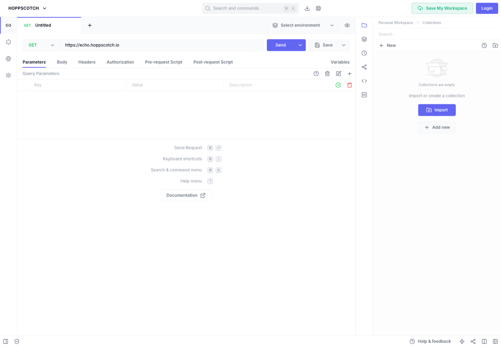

# API 调试与后端开发工具

> Category: **后端 / API**
>
> Audience: 后端、全栈、AI 应用开发者
>
> Screenshot: [https://hoppscotch.io/](https://hoppscotch.io/)

## Overview

整理 API 调试、接口文档、命令行 HTTP、后端框架、数据库和 BaaS 工具。

## Scope

本页只收录与该主题直接相关、入口稳定、说明清晰的资源。优先选择官方文档、主流开源仓库、长期可访问的产品页面和常用工具链。

## Resources

| Resource | Use case |
| --- | --- |
| [Postman](https://www.postman.com/) | 主流 API 开发协作平台。 |
| [Insomnia](https://insomnia.rest/) | API 调试客户端。 |
| [Hoppscotch](https://hoppscotch.io/) | 开源 API 调试工具。 |
| [Bruno](https://www.usebruno.com/) | 本地优先 API 客户端。 |
| [HTTPie](https://httpie.io/) | 友好的命令行 HTTP 工具。 |
| [Swagger / OpenAPI](https://swagger.io/specification/) | API 描述规范。 |
| [FastAPI](https://fastapi.tiangolo.com/) | Python API 框架。 |
| [Supabase](https://supabase.com/) | 开源 Firebase 替代。 |

## Recommended Path

1. 接口先写 OpenAPI，再调试。
2. 本地项目可用 Bruno 管理接口文件。
3. Python 后端快速 demo 选 FastAPI。

## Notes

- 生产 token 不应保存在公开 API collection。
- 接口文档若不随 CI 或代码同步维护，很快会失真。

## Maintenance

- Update links when official pages, pricing, quotas, or open-source status change.
- Use screenshots from public official pages and keep the source URL.
- Describe the concrete use case for each new entry.

---

[返回首页](../../README.md)
