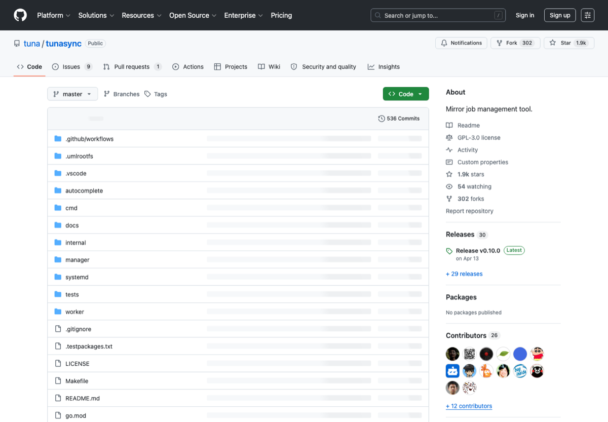

# 中文开源镜像与下载加速

> Category: **下载 / 镜像**
>
> Audience: 国内开发者、学生、服务器用户
>
> Screenshot: [https://github.com/tuna/tunasync](https://github.com/tuna/tunasync)

## Overview

整理国内高校和厂商开源镜像、包管理加速和常见开发依赖下载入口。

## Scope

本页只收录与该主题直接相关、入口稳定、说明清晰的资源。优先选择官方文档、主流开源仓库、长期可访问的产品页面和常用工具链。

## Resources

| Resource | Use case |
| --- | --- |
| [清华大学开源软件镜像站](https://mirrors.tuna.tsinghua.edu.cn/) | 国内常用高校镜像站。 |
| [中国科学技术大学镜像站](https://mirrors.ustc.edu.cn/) | 中科大开源镜像。 |
| [上海交通大学镜像站](https://mirror.sjtu.edu.cn/) | 上海交大镜像站。 |
| [北京外国语大学镜像站](https://mirrors.bfsu.edu.cn/) | BFSU 镜像站。 |
| [阿里云镜像站](https://developer.aliyun.com/mirror/) | 常用开发镜像配置文档。 |
| [npmmirror](https://npmmirror.com/) | npm 包镜像。 |
| [TUNA Anaconda 帮助](https://mirrors.tuna.tsinghua.edu.cn/help/anaconda/) | conda/anaconda 镜像配置。 |
| [TUNA PyPI 帮助](https://mirrors.tuna.tsinghua.edu.cn/help/pypi/) | pip 镜像配置。 |

## Recommended Path

1. 优先使用高校镜像官方帮助页配置。
2. 项目 README 里写清楚镜像只是加速，不是依赖来源。
3. 服务器上固定配置 pip/conda/npm 镜像。

## Notes

- 避免从来源不明的网盘下载开发工具。
- 镜像同步存在延迟，版本异常时先回官方源确认。

## Maintenance

- Update links when official pages, pricing, quotas, or open-source status change.
- Use screenshots from public official pages and keep the source URL.
- Describe the concrete use case for each new entry.

---

[返回首页](../../README.md)
