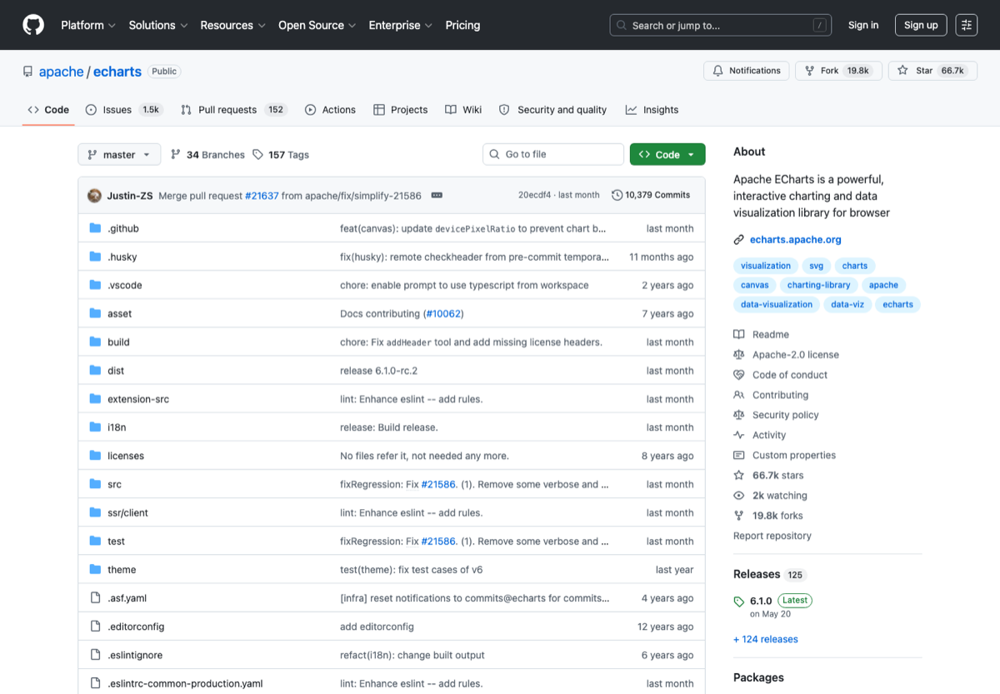

# 数据分析与可视化工具

> 分类：**数据 / 可视化**
>
> 适合：科研、运营、产品、数据分析和 dashboard 用户
>
> 截图来源：[https://github.com/apache/echarts](https://github.com/apache/echarts)

## 一句话

整理 Python 数据分析、数据库、本地 dashboard、交互图表和 BI 工具。

## 为什么值得收藏

数据可视化是跨行业刚需，开源工具成熟，适合做长期维护总表。

## 精选入口

| 名称 | 用途 |
| --- | --- |
| [Jupyter](https://jupyter.org/) | Notebook 数据分析环境。 |
| [Pandas](https://pandas.pydata.org/) | Python 数据分析基础库。 |
| [Polars](https://pola.rs/) | 高性能 DataFrame。 |
| [DuckDB](https://duckdb.org/) | 嵌入式分析数据库。 |
| [Plotly](https://plotly.com/python/) | 交互式图表。 |
| [Apache ECharts](https://echarts.apache.org/) | 强大的开源可视化图表库。 |
| [Streamlit](https://streamlit.io/) | 快速构建数据 App。 |
| [Apache Superset](https://superset.apache.org/) | 开源 BI 平台。 |

## 快速上手

1. 小数据先 Pandas，大数据/本地分析试 DuckDB/Polars。
2. 展示给别人看时用 Streamlit 或 Superset。
3. 论文图表先保证可复现。

## 常见坑

- 不要把图做得比数据更复杂。
- dashboard 上线前要处理权限和数据脱敏。

## 维护建议

- 如果某个工具出现价格、额度、开源状态或官网迁移，请优先改本页链接和说明。
- 如果补图，请使用官方公开页面截图，并保留来源链接。
- 如果新增入口，请写清楚它解决什么问题，避免变成无差别链接农场。

---

[返回首页](../../README.md)
