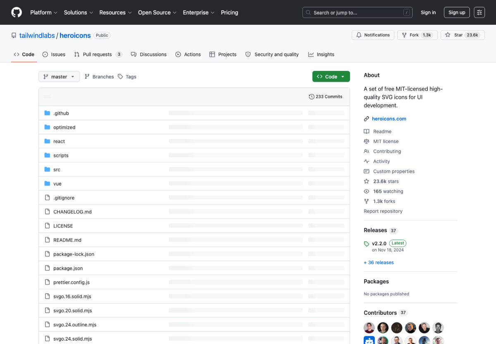

# 设计素材、图标与配图资源

> Category: **设计 / 素材**
>
> Audience: 做 README、论文图、PPT、网页和产品 demo 的人
>
> Screenshot: [https://github.com/tailwindlabs/heroicons](https://github.com/tailwindlabs/heroicons)

## Overview

整理图标、插图、字体、图片、动效和设计模板入口，强调授权和可商用边界。

## Scope

本页只收录与该主题直接相关、入口稳定、说明清晰的资源。优先选择官方文档、主流开源仓库、长期可访问的产品页面和常用工具链。

## Resources

| Resource | Use case |
| --- | --- |
| [Figma Templates](https://www.figma.com/templates/) | Figma 官方模板入口。 |
| [Material Symbols](https://fonts.google.com/icons) | Google 官方图标库。 |
| [Iconify](https://iconify.design/) | 统一搜索海量开源图标。 |
| [Lucide](https://lucide.dev/) | 简洁线性图标库。 |
| [Heroicons](https://heroicons.com/) | Tailwind 团队图标。 |
| [Unsplash](https://unsplash.com/) | 免费摄影图片。 |
| [Pexels](https://www.pexels.com/) | 免费图片和视频素材。 |
| [LottieFiles](https://lottiefiles.com/) | Lottie 动效素材和工具。 |

## Recommended Path

1. README 首屏先提供清晰封面图。
2. 图标保持统一风格，避免混用过多体系。
3. 使用素材前检查 license 和授权范围。

## Notes

- 网络图片不默认具备商用授权。
- 论文和商业项目应避免使用来源不明的素材。

## Maintenance

- Update links when official pages, pricing, quotas, or open-source status change.
- Use screenshots from public official pages and keep the source URL.
- Describe the concrete use case for each new entry.

---

[返回首页](../../README.md)
