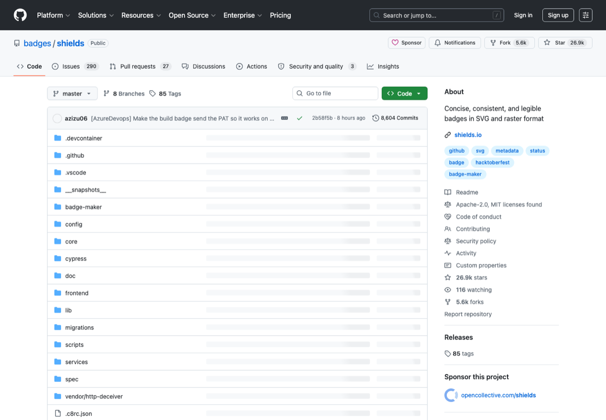

# GitHub 开源项目包装与发布

> 分类：**GitHub / 开源**
>
> 适合：想让项目更像正式开源产品的人
>
> 截图来源：[https://github.com/badges/shields](https://github.com/badges/shields)

## 一句话

整理 README、badge、Pages、release、贡献者、star history、部署和项目展示工具。

## 为什么值得收藏

很多人代码能写，但项目不会包装；这类清单直接服务 GitHub 涨星和面试展示。

## 精选入口

| 名称 | 用途 |
| --- | --- |
| [GitHub README Docs](https://docs.github.com/en/repositories/managing-your-repositorys-settings-and-features/customizing-your-repository/about-readmes) | 官方 README 说明。 |
| [Shields.io](https://shields.io/) | Badge 生成。 |
| [GitHub Pages](https://pages.github.com/) | 项目页托管。 |
| [Vercel](https://vercel.com/) | 前端项目部署。 |
| [Netlify](https://www.netlify.com/) | 静态站点部署。 |
| [Readme.so](https://readme.so/) | README 结构辅助。 |
| [Star History](https://star-history.com/) | star 增长图。 |
| [all-contributors](https://allcontributors.org/) | 贡献者展示规范。 |

## 快速上手

1. README 首屏必须说清楚项目解决什么。
2. 放截图、安装、Quick Start、FAQ 和 License。
3. 每次功能更新都发 release。

## 常见坑

- 不要在无关 issue 里硬广。
- 截图和 demo 链接比口号重要。

## 维护建议

- 如果某个工具出现价格、额度、开源状态或官网迁移，请优先改本页链接和说明。
- 如果补图，请使用官方公开页面截图，并保留来源链接。
- 如果新增入口，请写清楚它解决什么问题，避免变成无差别链接农场。

---

[返回首页](../../README.md)
