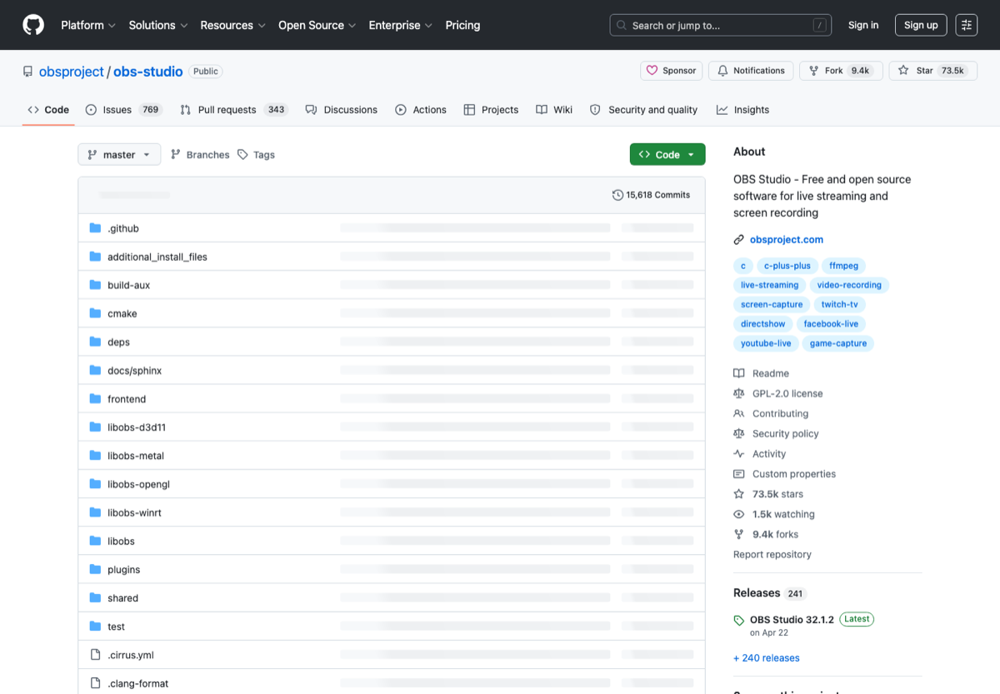

# 开源替代软件清单

> Category: **开源 / 替代**
>
> Audience: 想找免费、开源、跨平台软件的人
>
> Screenshot: [https://github.com/obsproject/obs-studio](https://github.com/obsproject/obs-studio)

## Overview

整理常见商业软件的开源替代入口，以及图片、视频、音频、办公和直播工具。

## Scope

本页只收录与该主题直接相关、入口稳定、说明清晰的资源。优先选择官方文档、主流开源仓库、长期可访问的产品页面和常用工具链。

## Resources

| Resource | Use case |
| --- | --- |
| [Open Source Alternative To](https://www.opensourcealternative.to/) | 按商业产品找开源替代。 |
| [AlternativeTo](https://alternativeto.net/) | 软件替代搜索。 |
| [LibreOffice](https://www.libreoffice.org/) | 开源办公套件。 |
| [GIMP](https://www.gimp.org/) | 图像编辑。 |
| [Krita](https://krita.org/) | 绘画和数字艺术。 |
| [Blender](https://www.blender.org/) | 3D 创作套件。 |
| [Inkscape](https://inkscape.org/) | 矢量图编辑。 |
| [OBS Studio](https://obsproject.com/) | 录屏和直播。 |

## Recommended Path

1. 先列出你正在用的付费工具。
2. 逐个找开源替代并试用一周。
3. 确认文件格式兼容后再迁移。

## Notes

- 开源不等于无条件免费商用，仍需检查 license。
- 替换核心软件前需验证文件兼容、协作流程和稳定性。

## Maintenance

- Update links when official pages, pricing, quotas, or open-source status change.
- Use screenshots from public official pages and keep the source URL.
- Describe the concrete use case for each new entry.

---

[返回首页](../../README.md)
