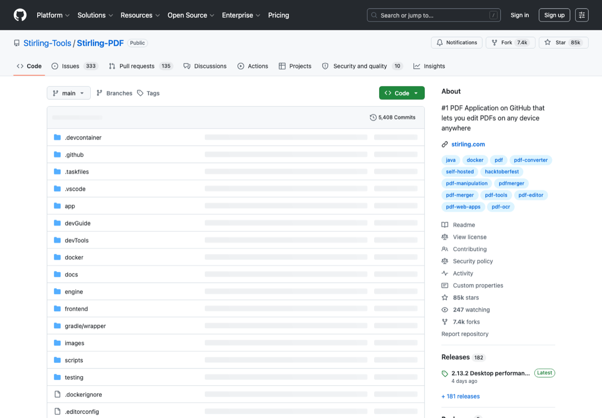

# PDF、OCR 与文档处理工具

> 分类：**文档 / OCR**
>
> 适合：处理论文、扫描件、合同、电子书和课件的人
>
> 截图来源：[https://github.com/Stirling-Tools/Stirling-PDF](https://github.com/Stirling-Tools/Stirling-PDF)

## 一句话

整理 PDF 合并拆分、OCR、格式转换、电子书管理、扫描件归档和数学公式识别工具。

## 为什么值得收藏

PDF 是学生和办公人群最高频痛点之一，好用工具贴长期有收藏价值。

## 精选入口

| 名称 | 用途 |
| --- | --- |
| [Stirling PDF](https://github.com/Stirling-Tools/Stirling-PDF) | 可自托管的 PDF 工具箱。 |
| [PDF24](https://www.pdf24.org/en/) | 在线/桌面 PDF 工具。 |
| [OCRmyPDF](https://ocrmypdf.readthedocs.io/) | 给扫描 PDF 加 OCR 文本层。 |
| [Tesseract OCR](https://github.com/tesseract-ocr/tesseract) | 开源 OCR 引擎。 |
| [Paperless-ngx](https://github.com/paperless-ngx/paperless-ngx) | 文档归档和 OCR 管理。 |
| [Pandoc](https://pandoc.org/) | 文档格式转换瑞士军刀。 |
| [Calibre](https://calibre-ebook.com/) | 电子书管理和转换。 |
| [Mathpix](https://mathpix.com/) | 公式和文档 OCR。 |

## 快速上手

1. 扫描件先 OCR，再归档。
2. 论文 PDF 用 Zotero 管理，办公 PDF 用 Stirling/PDF24。
3. 大批量转换优先 Pandoc 或脚本。

## 常见坑

- 敏感文件不要上传到未知在线工具。
- OCR 结果必须人工核对。

## 维护建议

- 如果某个工具出现价格、额度、开源状态或官网迁移，请优先改本页链接和说明。
- 如果补图，请使用官方公开页面截图，并保留来源链接。
- 如果新增入口，请写清楚它解决什么问题，避免变成无差别链接农场。

---

[返回首页](../../README.md)
