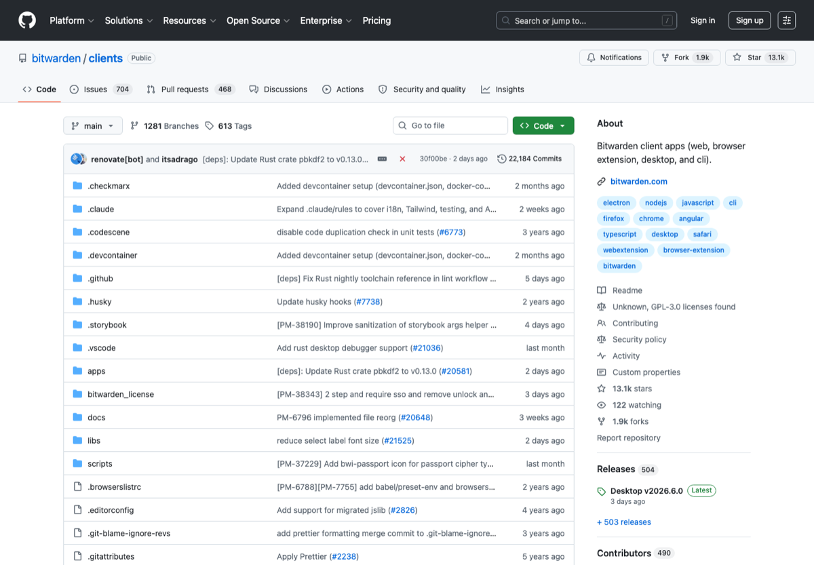

# 隐私、安全与密码管理工具

> 分类：**安全 / 隐私**
>
> 适合：学生、开发者、远程办公和注重隐私的人
>
> 截图来源：[https://github.com/bitwarden/clients](https://github.com/bitwarden/clients)

## 一句话

整理密码管理、加密通信、隐私邮箱、浏览器、安全检查和数据泄露查询入口。

## 为什么值得收藏

账号安全和隐私工具是长期刚需，尤其适合中文用户做基础安全教育。

## 精选入口

| 名称 | 用途 |
| --- | --- |
| [Privacy Guides](https://www.privacyguides.org/) | 隐私工具和建议总入口。 |
| [Bitwarden](https://bitwarden.com/) | 密码管理器。 |
| [KeePassXC](https://keepassxc.org/) | 本地开源密码库。 |
| [Proton Mail](https://proton.me/mail) | 注重隐私的邮箱服务。 |
| [Signal](https://signal.org/) | 端到端加密通讯。 |
| [Tor Browser](https://www.torproject.org/) | 匿名网络浏览器。 |
| [Have I Been Pwned](https://haveibeenpwned.com/) | 数据泄露查询。 |
| [age](https://github.com/FiloSottile/age) | 简单现代的文件加密工具。 |

## 快速上手

1. 先启用密码管理器和两步验证。
2. 重要账号使用独立邮箱和独立密码。
3. 定期查泄露并轮换密码。

## 常见坑

- 不要复用密码。
- 不要把 2FA 恢复码放在同一个云笔记里。

## 维护建议

- 如果某个工具出现价格、额度、开源状态或官网迁移，请优先改本页链接和说明。
- 如果补图，请使用官方公开页面截图，并保留来源链接。
- 如果新增入口，请写清楚它解决什么问题，避免变成无差别链接农场。

---

[返回首页](../../README.md)
