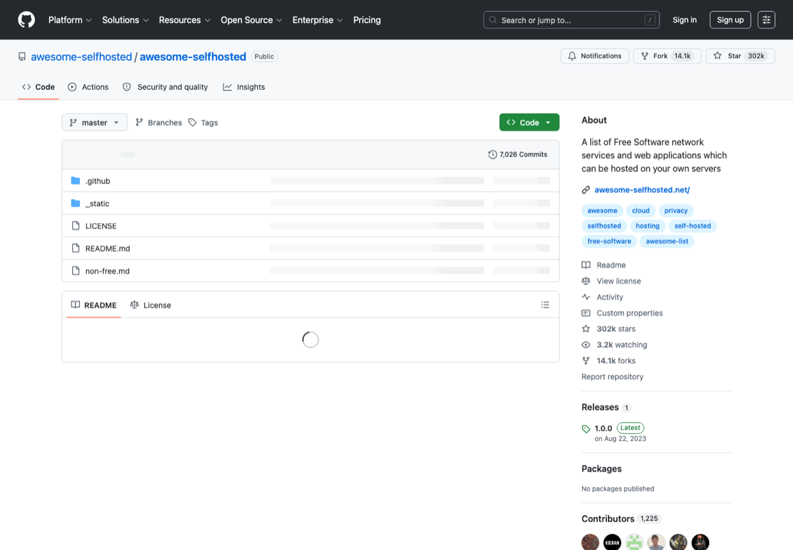

# 自托管服务与 NAS 工具

> Category: **自托管 / NAS**
>
> Audience: 想搭家庭服务器、NAS、个人云和内网服务的人
>
> Screenshot: [https://github.com/awesome-selfhosted/awesome-selfhosted](https://github.com/awesome-selfhosted/awesome-selfhosted)

## Overview

整理自托管入口、Docker 管理、相册、影音、网盘、密码库、Git 服务和监控工具。

## Scope

本页只收录与该主题直接相关、入口稳定、说明清晰的资源。优先选择官方文档、主流开源仓库、长期可访问的产品页面和常用工具链。

## Resources

| Resource | Use case |
| --- | --- |
| [awesome-selfhosted](https://github.com/awesome-selfhosted/awesome-selfhosted) | 自托管项目大列表。 |
| [Docker](https://www.docker.com/) | 容器基础设施。 |
| [CasaOS](https://casaos.io/) | 家庭云系统。 |
| [Immich](https://github.com/immich-app/immich) | 自托管相册。 |
| [Jellyfin](https://jellyfin.org/) | 自托管媒体服务器。 |
| [Nextcloud](https://nextcloud.com/) | 个人云盘和协作平台。 |
| [Vaultwarden](https://github.com/dani-garcia/vaultwarden) | 轻量 Bitwarden 兼容服务。 |
| [Uptime Kuma](https://github.com/louislam/uptime-kuma) | 自托管监控面板。 |

## Recommended Path

1. 先用 Docker Compose 管理服务。
2. 所有外网暴露服务都要有 HTTPS 和强密码。
3. 先搭备份，再搭相册和网盘。

## Notes

- 避免将管理面板直接暴露到公网。
- 家庭 NAS 的核心风险是缺少可靠备份，而不是部署失败。

## Maintenance

- Update links when official pages, pricing, quotas, or open-source status change.
- Use screenshots from public official pages and keep the source URL.
- Describe the concrete use case for each new entry.

---

[返回首页](../../README.md)
