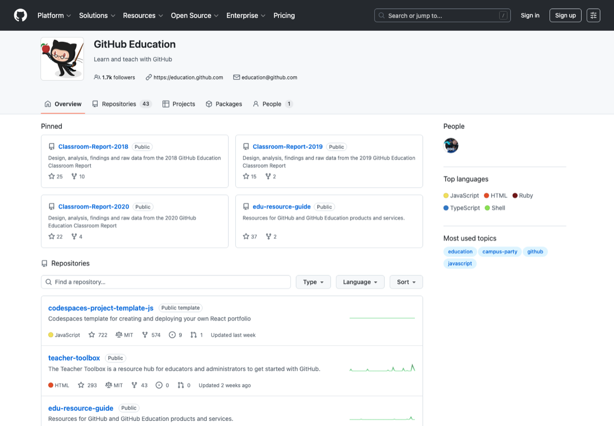

# 学生党 AI 与开发者福利

> 分类：**学生 / 福利**
>
> 适合：本科生、研究生、刚开始做项目的学生
>
> 截图来源：[https://github.com/github-education-resources](https://github.com/github-education-resources)

## 一句话

整理学生身份可申请的开发工具、云服务、设计工具、笔记工具和教育优惠入口。

## 为什么值得收藏

学生福利长期有搜索需求，且很多入口分散、资格规则变化快，中文总表非常容易被转发。

## 精选入口

| 名称 | 用途 |
| --- | --- |
| [GitHub Student Developer Pack](https://education.github.com/pack) | 学生开发者福利总入口。 |
| [GitHub Education](https://education.github.com/) | GitHub 教育认证与校园资源。 |
| [JetBrains for Students](https://www.jetbrains.com/community/education/#students) | JetBrains 全家桶学生授权。 |
| [Azure for Students](https://azure.microsoft.com/en-us/free/students) | 微软学生云资源。 |
| [Notion for Education](https://www.notion.so/product/notion-for-education) | Notion 学生教育计划。 |
| [Figma Education](https://www.figma.com/education/) | Figma 教育计划。 |
| [Canva Education](https://www.canva.com/education/) | Canva 教育资源。 |
| [Namecheap Education](https://nc.me/) | 学生域名相关优惠入口。 |

## 快速上手

1. 准备学校邮箱、学生证或学信/学校证明。
2. 先申请 GitHub Student Pack，因为它会解锁一串开发工具。
3. 记录每个福利的续期时间。

## 常见坑

- 不要用来路不明的教育邮箱。
- 免费额度也可能产生付费账单，云服务一定要设预算告警。

## 维护建议

- 如果某个工具出现价格、额度、开源状态或官网迁移，请优先改本页链接和说明。
- 如果补图，请使用官方公开页面截图，并保留来源链接。
- 如果新增入口，请写清楚它解决什么问题，避免变成无差别链接农场。

---

[返回首页](../../README.md)
