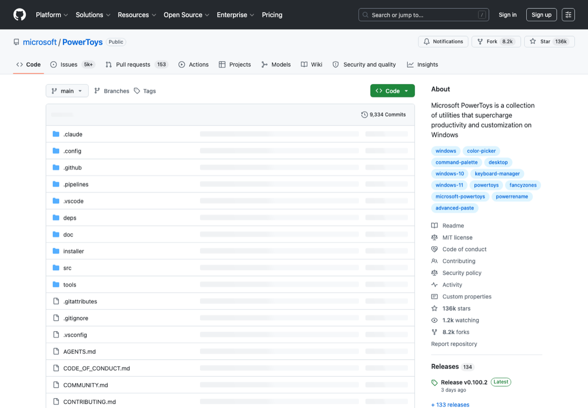

# Windows 效率与开发工具

> Category: **Windows / 效率**
>
> Audience: Windows 用户、学生、开发者
>
> Screenshot: [https://github.com/microsoft/PowerToys](https://github.com/microsoft/PowerToys)

## Overview

整理 Windows 上最值得安装的官方工具、终端、包管理、搜索、截图、剪贴板和磁盘分析工具。

## Scope

本页只收录与该主题直接相关、入口稳定、说明清晰的资源。优先选择官方文档、主流开源仓库、长期可访问的产品页面和常用工具链。

## Resources

| Resource | Use case |
| --- | --- |
| [Microsoft PowerToys](https://learn.microsoft.com/en-us/windows/powertoys/) | 微软官方效率工具合集。 |
| [Windows Terminal](https://github.com/microsoft/terminal) | 现代 Windows 终端。 |
| [winget](https://learn.microsoft.com/en-us/windows/package-manager/winget/) | Windows 官方包管理器。 |
| [WSL](https://learn.microsoft.com/en-us/windows/wsl/) | Windows Subsystem for Linux。 |
| [AutoHotkey](https://www.autohotkey.com/) | 自动化热键脚本。 |
| [Everything](https://www.voidtools.com/) | 极速文件搜索。 |
| [ShareX](https://getsharex.com/) | 截图录屏和上传工具。 |
| [WizTree](https://diskanalyzer.com/) | 磁盘空间分析工具。 |

## Recommended Path

1. 先装 PowerToys、Windows Terminal、winget。
2. 开发者再配置 WSL。
3. 文件搜索和截图工具能立刻提升效率。

## Notes

- 运行第三方 AHK 脚本前需检查源码和权限。
- 清理磁盘前先确认目标不是项目数据、索引或长期缓存。

## Maintenance

- Update links when official pages, pricing, quotas, or open-source status change.
- Use screenshots from public official pages and keep the source URL.
- Describe the concrete use case for each new entry.

---

[返回首页](../../README.md)
